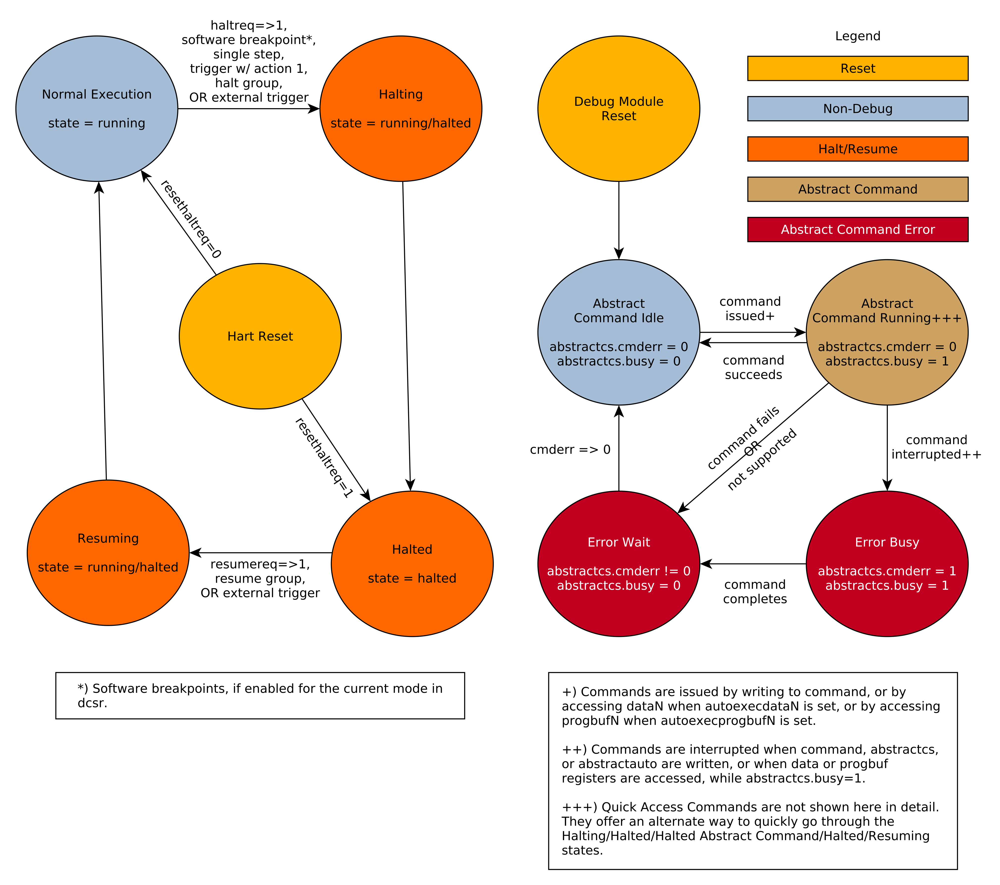

[[dm]]
== Debug Module (DM) (non-ISA extension)

The Debug Module implements a translation interface between abstract
debug operations and their specific implementation. It might support the
following operations:

. Give the debugger necessary information about the implementation.
(Required)
. Allow any individual hart to be halted and resumed. (Required)
. Provide status on which harts are halted. (Required)
. Provide abstract read and write access to a halted hart's GPRs.
(Required)
. Provide access to a reset signal that allows debugging from the very
first instruction after reset. (Required)
. Provide a mechanism to allow debugging harts immediately out of reset
(regardless of the reset cause). (Optional)
. Provide abstract access to non-GPR hart registers. (Optional)
. Provide a Program Buffer to force the hart to execute arbitrary
instructions. (Optional)
. Allow multiple harts to be halted, resumed, and/or reset at the same
time. (Optional)
. Allow memory access from a hart's point of view. (Optional)
. Allow direct System Bus Access. (Optional)
. Group harts. When any hart in the group halts, they all halt. (Optional)
. Respond to external triggers by halting each hart in a configured group.
(Optional)
. Signal an external trigger when a hart in a group halts. (Optional)

In order to be compatible with this specification an implementation
must:

. Implement all the required features listed above.
. Implement at least one of Program Buffer, System Bus Access, or Abstract
Access Memory command mechanisms.
. Do at least one of:
.. Implement the Program Buffer.
.. Implement abstract access to all registers that are visible to software
running on the hart including all the registers that are present on the
hart and listed in xref:tab:regno[].
.. Implement abstract access to at least all GPRs, {csr-dcsr}, and {csr-dpc}, and advertise the implementation as conforming to the "Minimal RISC-V Debug
Specification", instead of the "RISC-V Debug Specification".

A single DM can debug up to latexmath:[$2^{20}$] harts.

[[dmi]]
=== Debug Module Interface (DMI)

Debug Modules are subordinates on a bus called the Debug Module
Interface (DMI). The bus manager is the Debug Transport Module(s). The
Debug Module Interface can be a trivial bus with one manager and one
subordinate (see <<tab:dmi_signals>>), or use a more
full-featured bus like TileLink or the AMBA Advanced Peripheral Bus. The
details are left to the system designer.

The DMI uses between 7 and 32 address bits. Each address points at a
single 32-bit register that can be read or written. The bottom of the
address space is used for the first (and usually only) DM. Extra space
can be used for custom debug devices, other cores, additional DMs, etc.
If there are additional DMs on this DMI, the base address of the next DM
in the DMI address space is given in {dm-nextdm}.

The Debug Module is controlled via register accesses to its DMI address
space.

[[reset]]
=== Reset Control

There are two methods that allow a debugger to reset harts. {dmcontrol-ndmreset} resets all
the harts in the hardware platform, as well as all other parts of the
hardware platform except for the Debug Modules, Debug Transport Modules,
and Debug Module Interface. Exactly what is affected by this reset is
implementation dependent, but it must be possible to debug programs from
the first instruction executed. {dmcontrol-hartreset} resets all the currently selected harts.
In this case an implementation may reset more harts than just the ones
that are selected. The debugger can discover which other harts are reset
(if any) by selecting them and checking {dmstatus-anyhavereset} and {dmstatus-allhavereset}.

To perform either of these resets, the debugger first asserts the bit,
and then clears it. The actual reset may start as soon as the bit is
asserted, but may start an arbitrarily long time after the bit is
deasserted. The reset itself may also take an arbitrarily long time.
While the reset is on-going, harts are either in the running state,
indicating it's possible to perform some abstract commands during this
time, or in the unavailable state, indicating it's not possible to
perform any abstract commands during this time. Once a hart's reset is
complete, `havereset` becomes set. When a hart comes out of reset and {dmcontrol-haltreq} or {dmstatus-hasresethaltreq} 
are set, the hart will immediately enter Debug Mode (halted state).
Otherwise, if the hart was initially running it will execute normally
(running state) and if the hart was initially halted it should now be
running but may be halted.

[NOTE]
====
There is no general, reliable way for the debugger to know when reset
has actually begun.
====

The Debug Module's own state and registers should only be reset at
power-up and while {dmcontrol-dmactive} in {dm-dmcontrol} is 0. If there is another mechanism to reset the DM, this mechanism must also reset all the harts accessible to the DM.

Due to clock and power domain crossing issues, it might not be possible
to perform arbitrary DMI accesses across hardware platform reset. While
{dmcontrol-ndmreset}  or any external reset is asserted, the only supported DM
operations are reading/writing {dm-dmcontrol} and reading
{dmstatus-ndmresetpending}. The behavior of other accesses is undefined.

When harts have been reset, they must set a sticky `havereset` state
bit. The conceptual `havereset` state bits can be read for selected
harts in {dmstatus-anyhavereset} and {dmstatus-allhavereset} in {dm-dmstatus}. These bits must be set regardless of the cause of the
reset. The `havereset` bits for the selected harts can be cleared by
writing 1 to {dmcontrol-ackhavereset} in {dm-dmcontrol}. The `havereset` bits might or might not be cleared when {dmcontrol-dmactive} is low.

[[selectingharts]]
=== Selecting Harts

Up to latexmath:[$2^{20}$] harts can be connected to a single DM.
Commands issued to the DM only apply to the currently selected harts.

To enumerate all the harts, a debugger must first determine `HARTSELLEN`
by writing all ones to {hartsel} (assuming the maximum size) and reading back the
value to see which bits were actually set. Then it selects each hart
starting from 0 until either {dmstatus-anynonexistent} in {dm-dmstatus} is 1, or the highest index (depending on `HARTSELLEN`) is reached.

The debugger can discover the mapping between hart indices and `mhartid` by using
the interface to read `mhartid`, or by reading the hardware platform's
configuration structure.

==== Selecting a Single Hart

All debug modules must support selecting a single hart. The debugger can
select a hart by writing its index to {hartsel}. Hart indexes start at 0 and are
contiguous until the final index.

[[hartarraymask]]
==== Selecting Multiple Harts

Debug Modules may implement a Hart Array Mask register to allow
selecting multiple harts at once. The latexmath:[$n$]th bit in the Hart
Array Mask register applies to the hart with index latexmath:[$n$]. If
the bit is 1 then the hart is selected. Usually a DM will have a Hart
Array Mask register exactly wide enough to select all the harts it
supports, but it's allowed to tie any of these bits to 0.

The debugger can set bits in the hart array mask register using {dm-hawindowsel} and {dm-hawindow},
then apply actions to all selected harts by setting {dmcontrol-hasel}. If this feature is
supported, multiple harts can be halted, resumed, and reset
simultaneously. The state of the hart array mask register is not
affected by setting or clearing {dmcontrol-hasel}.

Execution of Abstract Commands ignores this mechanism and only applies
to the hart selected by {hartsel}.

=== Hart DM States

Every hart that can be selected is in exactly one of the following four
DM states: non-existent, unavailable, running, or halted. Which state
the selected harts are in is reflected by {dmstatus-allnonexistent}, {dmstatus-anynonexistent}, {dmstatus-allunavail}, {dmstatus-anyunavail}, {dmstatus-allrunning}, {dmstatus-anyrunning}, {dmstatus-allhalted}, and {dmstatus-anyhalted}.

Harts are nonexistent if they will never be part of this hardware
platform, no matter how long a user waits. E.g. in a simple single-hart
hardware platform only one hart exists, and all others are nonexistent.
Debuggers may assume that a hardware platform has no harts with indexes
higher than the first nonexistent one.

Harts are unavailable if they might exist/become available at a later
time, or if there are other harts with higher indexes than this one.
Harts may be unavailable for a variety of reasons including being reset,
temporarily powered down, and not being plugged into the hardware
platform. That means harts might become available or unavailable at any
time, although these events should be rare in hardware platforms built
to be easily debugged. There are no guarantees about the state of the
hart when it becomes available.

Hardware platforms with very large number of harts may permanently
disable some during manufacturing, leaving holes in the otherwise
continuous hart index space. In order to let the debugger discover all
harts, they must show up as unavailable even if there is no chance of
them ever becoming available.

Harts are running when they are executing normally, as if no debugger
was attached. This includes being in a low power mode or waiting for an
interrupt, as long as a halt request will result in the hart being
halted.

Harts are halted when they are in Debug Mode, only performing tasks on
behalf of the debugger.

Which states a hart that is reset goes through is implementation
dependent. Harts may be unavailable while reset is asserted, and some
time after reset is deasserted. They might transition to running for
some time after reset is deasserted. Finally they end up either running
or halted, depending on {dmcontrol-haltreq} and {dmstatus-hasresethaltreq}.

[[runcontrol]]
=== Run Control

For every hart, the Debug Module tracks 4 conceptual bits of state: halt
request, resume ack, halt-on-reset request, and hart reset. (The hart
reset and halt-on-reset request bits are optional.) These 4 bits reset
to 0, except for resume ack, which may reset to either 0 or 1. The DM
receives halted, running, and havereset signals from each hart. The
debugger can observe the state of resume ack in {dmstatus-allresumeack} and {dmstatus-anyresumeack}, and the state of halted, running, and havereset signals in {dmstatus-allhalted}, {dmstatus-anyhalted}, {dmstatus-allrunning}, {dmstatus-anyrunning}, {dmstatus-allhavereset}, and {dmstatus-anyhavereset}. The state of the other bits cannot be observed directly.

When a debugger writes 1 to {dmcontrol-haltreq}, each selected hart's halt request bit is
set. When a running hart, or a hart just coming out of reset, sees its
halt request bit high, it responds by halting, deasserting its running
signal, and asserting its halted signal. Halted harts ignore their halt
request bit.

When a debugger writes 1 to {dmcontrol-resumereq}, each selected hart's resume ack bit is
cleared and each selected, halted hart is sent a resume request. Harts
respond by resuming, clearing their halted signal, and asserting their
running signal. At the end of this process the resume ack bit is set.
These status signals of all selected harts are reflected in {dmstatus-allresumeack}, {dmstatus-anyresumeack}, {dmstatus-allrunning}, and {dmstatus-anyrunning}. Resume requests are ignored by running harts.

When halt or resume is requested, a hart must respond in less than one
second, unless it is unavailable. (How this is implemented is not
further specified. A few clock cycles will be a more typical latency).

The DM can implement optional halt-on-reset bits for each hart, which it
indicates by setting {dmstatus-hasresethaltreq} to 1. This means the DM implements the {dmcontrol-setresethaltreq} and {dmcontrol-clrresethaltreq} bits.  Writing 1 to {dmcontrol-setresethaltreq} sets the halt-on-reset request bit for each selected hart.
When a hart's halt-on-reset request bit is set, the hart will
immediately enter debug mode on the next deassertion of its reset. This
is true regardless of the reset's cause. The hart's halt-on-reset
request bit remains set until cleared by the debugger writing 1 to {dmcontrol-clrresethaltreq} while the hart is selected, or by DM reset.

If the DM is reset while a hart is halted, it is UNSPECIFIED whether that hart
resumes. Debuggers should use {dmcontrol-resumereq} to explicitly resume harts before clearing {dmcontrol-dmactive} and disconnecting.

[[hrgroups]]
=== Halt Groups, Resume Groups, and External Triggers

An optional feature allows a debugger to place harts into two kinds of
groups: halt groups and resume groups. It is also possible to add
external triggers to a halt and resume groups. At any given time, each
hart and each trigger is a member of exactly one halt group and exactly
one resume group.

In both halt and resume groups, group 0 is special. Harts in group 0
halt/resume as if groups aren’t implemented at all.

When any hart in a halt group halts:

. That hart halts normally, with {dcsr-cause} reflecting the original cause of the
halt.
. All the other harts in the halt group that are running will quickly
halt. {dcsr-cause} for those harts should be set to 6, but may be set to 3. Other
harts in the halt group that are halted but have started the process of
resuming must also quickly become halted, even if they do resume
briefly.
. Any external triggers in that group are notified.

Adding a hart to a halt group does not automatically halt that hart,
even if other harts in the group are already halted.

When an external trigger that's a member of the halt group fires:

. All the harts in the halt group that are running will quickly halt. {dcsr-cause} for
those harts should be set to 6, but may be set to 3. Other harts in the
halt group that are halted but have started the process of resuming must
also quickly become halted, even if they do resume briefly.

When any hart in a resume group resumes:

. All the other harts in that group that are halted will quickly resume as
soon as any currently executing abstract commands have completed. Each
hart in the group sets its resume ack bit as soon as it has resumed.
Harts that are in the process of halting should complete that process
and stay halted.
. Any external triggers in that group are notified.

Adding a hart to a resume group does not automatically resume that hart,
even if other harts in the group are currently running.

When an external trigger that's a member of the resume group fires:

. All the harts in that group that are halted will quickly resume as soon
as any currently executing abstract commands have completed. Each hart
in the group sets its resume ack bit as soon as it has resumed. Harts
that are in the process of halting should complete that process and stay
halted.

External triggers are abstract concepts that can signal the DM and/or
receive signals from the DM. This configuration is done through {dm-dmcs2}, where
external triggers are referred to by a number. Commonly, external
triggers are capable of sending a signal from the hardware platform into
the DM, as well as receiving a signal from the DM to take their own
action on. It is also allowable for an external trigger to be input-only
or output-only. By convention external triggers 0-7 are bidirectional,
triggers 8-11 are input-only, and triggers 12-15 are output-only but
this is not required.

[NOTE]
====
External triggers could be used to implement near simultaneous
halting/resuming of all cores in a hardware platform, when not all cores
are RISC-V cores.
====

When the DM is reset, all harts must be placed in the lowest-numbered
halt and resume groups that they can be in. (This will usually be group
0.)

Some designs may choose to hardcode hart groups to a group other than
group 0, meaning it is never possible to halt or resume just a single
hart. This is explicitly allowed. In that case it must be possible to
discover the groups by using {dm-dmcs2} even if it's not possible to change the
configuration.

[[abstractcommands]]
=== Abstract Commands

The DM supports a set of abstract commands, most of which are optional.
Depending on the implementation, the debugger may be able to perform
some abstract commands even when the selected hart is not halted.
Debuggers can only determine which abstract commands are supported by a
given hart in a given state (running, halted, or held in reset) by
attempting them and then looking at {abstractcs-cmderr} in {dm-abstractcs} to see if they were successful. Commands may be supported with some options set, but not with other
options set. If a command has unsupported options set or if bits that
are defined as 0 aren't 0, then the DM must set {abstractcs-cmderr} to 2 (not supported).

[NOTE]
====
Example: Every DM must support the Access Register command, but might
not support accessing CSRs. If the debugger requests to read a CSR in
that case, the command will return "not supported".
====

Debuggers execute abstract commands by writing them to {dm-command}. They can
determine whether an abstract command is complete by reading {abstractcs-busy} in {dm-abstractcs}. If the debugger starts a new command while {abstractcs-busy} is set, {abstractcs-cmderr} becomes 1 (busy), the
currently executing command still gets to run to completion, but any
error generated by the currently executing command is lost. After
completion, {abstractcs-cmderr} indicates whether the command was successful or not.
Commands may fail because a hart is not halted, not running,
unavailable, or because they encounter an error during execution.

If the command takes arguments, the debugger must write them to the
`data` registers before writing to {dm-command}. If a command returns results, the
Debug Module must ensure they are placed in the `data` registers before {abstractcs-busy}
is cleared. Which `data` registers are used for the arguments is
described in <<tab:datareg>>. In all cases the
least-significant word is placed in the lowest-numbered `data` register.
The argument width depends on the command being executed, and is DXLEN
where not explicitly specified.

[[tab:datareg]]
.Use of Data Registers
[%autowidth,float="center",align="center",cols="^,<,<,<",options="header"]
|===
| Argument Width | arg0/return value | arg1 | arg2
| 32 | {dm-data0} | `data1` | `data2`
| 64 | {dm-data0}, `data1` | `data2`, `data3` | `data4`, `data5`
|128 | {dm-data0}-`data3` | `data4`-`data7` | `data8`-`data11`
|===

[NOTE]
====
The Abstract Command interface is designed to allow a debugger to write
commands as fast as possible, and then later check whether they
completed without error. In the common case the debugger will be much
slower than the target and commands succeed, which allows for maximum
throughput. If there is a failure, the interface ensures that no
commands execute after the failing one. To discover which command
failed, the debugger has to look at the state of the DM (e.g. contents
of {dm-data0}) or hart (e.g. contents of a register modified by a Program Buffer program) to determine which one failed.
====

Before starting an abstract command, a debugger must ensure that {dmcontrol-haltreq}, {dmcontrol-resumereq}, and {dmcontrol-ackhavereset} are all 0.

While an abstract command is executing ({abstractcs-busy} in {dm-abstractcs} is high), a debugger must not change {hartsel}, and must not write 1 to {dmcontrol-haltreq}, {dmcontrol-resumereq}, {dmcontrol-ackhavereset}, {dmcontrol-setresethaltreq}, or {dmcontrol-clrresethaltreq}.
The exception to this rule is when the debugger writes 0 to
{dmcontrol-dmactive}. In that case {hartsel} may be written with a new value
(which the hardware should ignore).
The hardware should not rely on this debugger behavior, but enforce it by
ignoring writes to these bits while {abstractcs-busy} is high.

If an abstract command does not complete in the expected time and
appears to be hung, the debugger can try to reset the hart (using {dmcontrol-hartreset} or {dmcontrol-ndmreset}).
If that doesn't clear {abstractcs-busy}, then it can try resetting the Debug Module
(using {dmcontrol-dmactive}).

If an abstract command is started while the selected hart is unavailable
or if a hart becomes unavailable while executing an abstract command,
then the Debug Module may terminate the abstract command, setting {abstractcs-busy} low,
and {abstractcs-cmderr} to 4 (halt/resume). Alternatively, the command could just appear to
be hung ({abstractcs-busy} never goes low).

==== Abstract Command Listing

This section describes each of the different abstract commands and how
their fields should be interpreted when they are written to {dm-command}.

Each abstract command is a 32-bit value. The top 8 bits contain {command-cmdtype} which
determines the kind of command. <<tab:cmdtype>> lists all commands.

[[tab:cmdtype]]
.Meaning of {command-cmdtype}
[%autowidth,float="center",align="center",cols=">,<",options="header"]
|===
| {command-cmdtype} | Command 
| 0 | <<ac-accessregister, Access Register Command>>
| 1 | <<ac-quickaccess, Quick Access>>
| 2 | <<ac-accessmemory, Access Memory Command>>
|===

include::build/abstract_commands.adoc[]

[[programbuffer]]
=== Program Buffer

To support executing arbitrary instructions on a halted hart, a Debug
Module can include a Program Buffer that a debugger can write small
programs to. DMs that support all necessary functionality using abstract
commands only may choose to omit the Program Buffer.

A debugger can write a small program to the Program Buffer, and then
execute it exactly once with the Access Register Abstract Command,
setting the {accessregister-postexec} bit in {dm-command}. The debugger can write whatever program it likes
(including jumps out of the Program Buffer), but the program must end
with `ebreak` or `c.ebreak`. An implementation may support an implicit
`ebreak` that is executed when a hart runs off the end of the Program
Buffer. This is indicated by {dmstatus-impebreak}. With this feature, a Program Buffer of
just 2 32-bit words can offer efficient debugging.

While these programs are executed, the hart does not leave Debug Mode
(see <<debugmode>>). If an exception is
encountered during execution of the Program Buffer, no more instructions
are executed, the hart remains in Debug Mode, and {abstractcs-cmderr} is set to 3
(`exception error`). If the debugger executes a program that doesn’t
terminate with an `ebreak` instruction, the hart will remain in Debug
Mode and the debugger will lose control of the hart.

If {abstractcs-progbufsize} is 1 then the following apply:

. {dmstatus-impebreak} must be 1.
. If the debugger writes a compressed instruction into the Program Buffer,
it must be placed into the lower 16 bits and accompanied by a compressed
`nop` in the upper 16 bits.

[NOTE]
====
This requirement on the debugger for the case of {abstractcs-progbufsize} equal to 1 is to
accommodate hardware designs that prefer to stuff instructions directly
into the pipeline when halted, instead of having the Program Buffer
exist in the address space somewhere.
====

The Program Buffer may be implemented as RAM which is accessible to the
hart. A debugger can determine if this is the case by executing small
programs that attempt to write and read back relative to `pc` while executing
from the Program Buffer. If so, the debugger has more flexibility in
what it can do with the program buffer.

=== Overview of Hart Debug States

<<abstract_sm>> shows a conceptual view of the states
passed through by a hart during run/halt debugging as influenced by the
different fields of {dm-dmcontrol}, {dm-abstractcs}, {dm-abstractauto}, and {dm-command}.

[[abstract_sm]]
.Run/Halt Debug State Machine for single-hart hardware platforms. As only a small amount of state is visible to the debugger, the states and transitions are conceptual.

[[systembusaccess]]
=== System Bus Access

A debugger can access memory from a hart's point of view using a Program
Buffer or the Abstract Access Memory command. (Both these features are
optional.) A Debug Module may also include a System Bus Access block to
provide memory access without involving a hart, regardless of whether
Program Buffer is implemented. The System Bus Access block uses physical
addresses.

The System Bus Access block may support 8-, 16-, 32-, 64-, and 128-bit
accesses. <<sbdatabits>> shows which bits in `sbdata` are used for each access size.

<<<

[[sbdatabits]]
.System Bus Data Bits
[%autowidth,align="center",float="center",cols=">,<",options="header"]
|===
|Access Size | Data Bits
| 8 | {dm-sbdata0} bits 7:0
| 16 | {dm-sbdata0} bits 15:0
| 32 | {dm-sbdata0}
| 64 | {dm-sbdata1}, {dm-sbdata0}
| 128 | {dm-sbdata3}, {dm-sbdata2}, {dm-sbdata1}, {dm-sbdata0}
|===

Depending on the microarchitecture, data accessed through System Bus
Access might not always be coherent with that observed by each hart. It
is up to the debugger to enforce coherency if the implementation does
not. This specification does not define a standard way to do this.
Possibilities may include writing to special memory-mapped locations, or
executing special instructions via the Program Buffer.

[NOTE]
====
Implementing a System Bus Access block has several benefits even when a
Debug Module also implements a Program Buffer. First, it is possible to
access memory in a running system with minimal impact. Second, it may
improve performance when accessing memory. Third, it may provide access
to devices that a hart does not have access to.
====

=== Minimally Intrusive Debugging

Depending on the task it is performing, some harts can only be halted
very briefly. There are several mechanisms that allow accessing
resources in such a running system with a minimal impact on the running
hart.

First, an implementation may allow some abstract commands to execute
without halting the hart.

Second, the Quick Access abstract command can be used to halt a hart,
quickly execute the contents of the Program Buffer, and let the hart run
again. Combined with instructions that allow Program Buffer code to
access the `data` registers, as described in {dm-hartinfo}, this can be used to
quickly perform a memory or register access. For some hardware platforms
this will be too intrusive, but many hardware platforms that can't be
halted can bear an occasional hiccup of a hundred or less cycles.

Third, if the System Bus Access block is implemented, it can be used
while a hart is running to access system memory.

=== Security

To protect intellectual property it may be desirable to lock access to
the Debug Module. To allow access during a manufacturing process and not
afterwards, a reasonable solution could be to add a fuse bit to the
Debug Module that can be used to permanently disable it. Since this
is technology specific, it is not further addressed in this spec.

Another option is to allow the DM to be unlocked only by users who have
an access key. Between {dmstatus-authenticated}, {dmstatus-authbusy}, and {dm-authdata} arbitrarily complex authentication
mechanism can be supported. When {dmstatus-authenticated} is clear, the DM must not interact with
the rest of the hardware platform, nor expose details about the harts
connected to the DM. All DM registers should read 0, while writes should
be ignored, with the following mandatory exceptions:

. {dmstatus-authenticated} in {dm-dmstatus} is readable.
. {dmstatus-authbusy} in {dm-dmstatus} is readable.
. {tinfo-version} in {dm-dmstatus} is readable.
. {dmcontrol-dmactive} in {dm-dmcontrol} is readable and writable.
. {dm-authdata} is readable and writable.

Implementations where it's not possible to unlock the DM by using {dm-authdata} should not implement that register.

=== Version Detection

To detect the version of the Debug Module with a minimum of side
effects, use the following procedure:

. Read {dm-dmcontrol}.
. If {dmcontrol-dmactive} is 0 or {dmcontrol-ndmreset} is 1:
.. Write {dm-dmcontrol}, preserving {dmcontrol-hartreset}, {dmcontrol-hasel}, {dmcontrol-hartsello}, and {dmcontrol-hartselhi} from the value that was read, setting {dmcontrol-dmactive}, and clearing all the other bits.
.. Read {dm-dmcontrol} until {dmcontrol-dmactive} is high.
. Read {dm-dmstatus}, which contains {dmstatus-version}.

If it was necessary to clear {dmcontrol-ndmreset}, this might have the following  
side effects:

. {dmcontrol-haltreq} is cleared, potentially preventing a halt request made by a previous debugger from taking effect.
. {dmcontrol-resumereq} is cleared, potentially preventing a resume request made by a previous debugger from taking effect.
. {dmcontrol-ndmreset} is deasserted, releasing the hardware platform from reset if a previous debugger had set it.
. {dmcontrol-dmactive} is asserted, releasing the DM from reset. This in itself is not
observable by any harts.

This procedure is guaranteed to work in future versions of this spec.
The meaning of the {dm-dmcontrol} bits where {dmcontrol-hartreset}, {dmcontrol-hasel}, {dmcontrol-hartsello}, and {dmcontrol-hartselhi} currently reside might change,
but preserving them will have no side effects. Clearing the bits of {dm-dmcontrol} not explicitly mentioned here will have no side effects beyond the ones mentioned above.

[[debbus]]
=== Debug Module Registers

The registers described in this section are accessed over the DMI bus.
Each DM has a base address (which is 0 for the first DM). The register
addresses below are offsets from this base address.

Debug Module DMI Registers that are unimplemented or not mentioned in
the table below return 0 when read. Writing them has no effect.

include::build/dm_registers.adoc[]
